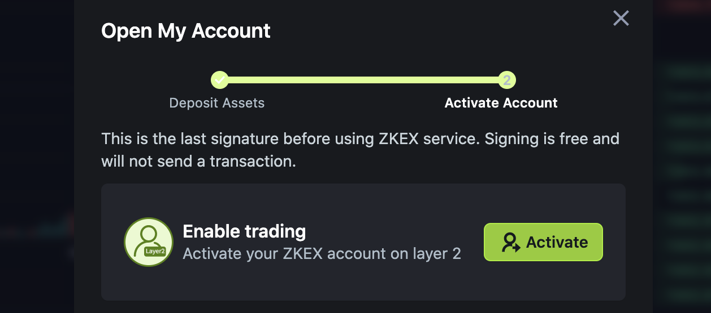

# 📄 Get started on the ZKEX Testnet

## Add the testnet networks to your wallet

The ZKEX testnet is a demo playground and uses several testnet network chains to allow people to conduct test multi-chain trades with 'fake' tokens.

Goerli Testnet and Rinkeby Testnet (Ethereum Testnets) are setup by in Metamask.

Go to https://chainlist.org/ and check 'Testnets'. You need to connect your wallet to the site so that the networks are added automatically.

Search for Avalanche, and add the Avalanche Fuji Testnet:

Search for Polygon, and add the Mumbai Testnet:

## Connect your wallet to ZKEX

Go to https://testnet.app.zkex.com/ and choose either light or dark mode on the top-right cornetr button.

Click 'Connect Wallet'

Choose which wallet you want to use. In this tutorial we will use MetaMask.

Sign in to your wallet if needed.

Next, you will receive two signature requests. Click the Activate button.

The first signature request creates a private key. Click the Sign button.

The second signature request creates a connection to ZKEX. Click the Sign button.

You can see here the Network switcher was in Red ... this is a good time to switch over to one of the testnet chains.

## Open an account on ZKEX

Click the 'Open My Account' button

Let's get some test tokens by clicking 'ZKEX faucet'

Let's get some USD. Select that, then click 'Claim'.

After a few seconds, you'll be able to open your account. Click 'Activate'.

The last signature request will activate your account. Click the Sign button.

We're done! Click the 'Start trading' button

## Get test tokens

If your tokens didn't come through immediately, don't worry let's try to get some more. Click 'Get test tokens'.

Let's get USD again. If its successful, you'll see a confirmation popup at the bottom of the page.

After waiting a few minutes, then refreshing the page, we see our USD has appeared! Feel free to explore and get some other test tokens.

## Start trading

Let's make a market order and buy some crypto. On the left of the screen, let's choose wETH. Remember, this is just a fake token on our testnet.

On the right of the screen, select 'Market' order from the dropdown (an instant market price buy) then enter any amount (say $500) and click 'Buy'.

After a couple of seconds the trade is executed and you'll see your balance updated.

## Next steps

You're setup now! Go ahead and try different Buy and Sell orders.

We will soon add more tutorials for you to explore all the features of the testnet.
