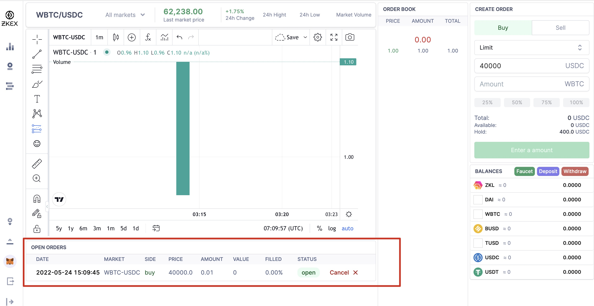

# 📄 User manual

## Step 1. Set up testnet & connect wallet

Current we support four test chains: Rinkeby, Goerli, AVAX Testnet, and Polygon Testnet. You may connect to one or more chains.

a. In your Metamask, click your current network, and click "Add Network".

b. Fill in the following parameters and click "Save".

- AVAX Testnet

  - networkName: Avalanche Fuji Testnet
  - RPC Url: https://api.avax-test.network/ext/bc/C/rpc
  - chainId: 43113
  - symbol: AVAX
  - explorerUrl: https://testnet.snowtrace.io/

- Polygon Testnet

  - networkName: Mumbai Testnet
  - RPC Url: https://rpc-mumbai.maticvigil.com
  - chainId: 80001
  - symbol: Matic
  - explorerUrl: https://explorer-mumbai.maticvigil.com

- Rinkeby & Goerli Testnet
  - Goerli Testnet and Rinkeby Testnet (Ethereum Testnets) are set to default in the your networks.

c. In ZKEX, click "Connect Wallet" - "Activate Account".

d. Ready to place an order.

## Step 2. Claim testnet tokens

To “Activate Account”, you need funds in Layer 2 wallet. No worries, we have prepared faucet for you.

a. Click "Faucet".

b. In the popup, select a token and click it.

c. Click "Get".

d. You will see your balance on the bottom-right.

## Step 3. Place a limit order

a. Choose a direction (buy/sell).

b. Set up your limit price.

c. Put in the amount that you wish to buy.

d. Click "Buy".

e. Sign in your wallet.

f. Wait for your order to be fulfilled. See details in "open orders".

## Credit Cookie: Token Merge

> One of ZKEX's unique features is that we eliminate the difference of the same kind of tokens on different chains (e.g., USDT-Solana and USDT-Ethereum) and merge them into **the same kind** on ZKEX layer2 order book DEX.

To experience this magical trick, you should:

1. Claim test tokens (USDC) from different chains to your Metamask on [L1 faucet](https://zk.link/app/faucet).

- a. Select a network.
- b. Choose a token.
- c. Click "Get".
- d. Switch a network and repeat step a to c.
  

2. Deposit them separately from each chain to ZKEX.

- a. Connect your wallet.
- b. Click "Deposit".
- c. Choose network, token, amount, and click "Approve".
- d. Switch a network and repeat step a to c.
  
  

3. You will see that there's no difference of USDC by chains on ZKEX, and the balance from each chain is summed up, displayed as "USDC".
   
